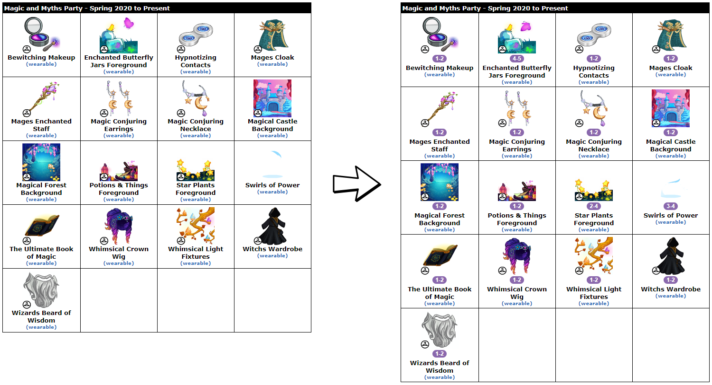

# NC-Trading-Valuator
Automatically label NC items with crowdsourced trading values. Visit ~/lebron to refresh values.

Values items at:
- Neopets 
  - Beta Inventory
  - Classic Inventory
  - Closet
  - SDB
  - Gallery
- JellyNeo 
  - Item Database
  - Articles
- Classic & 2020 DTI
  - Wardrobe / Customizer
  - User Item List
  - Item Profile 
  - Item Search

#
#### Example: JN Shenanigifts Prizes

---
## Installation
This script is written and tested in Chrome on desktop, but should be compatible with all major browsers, including Firefox, Safari, Opera, and Edge. 

Please contact me on github or reddit if you encounter any issues.

1. Install the [Tampermonkey](https://www.tampermonkey.net/) browser extension, or other such userscript manager
2. Click [here](https://github.com/friendly-trenchcoat/NC-Trading-Valuator/raw/main/ncTradingValuator.user.js) to install the userscript
3. Visit [~/lebron](http://www.neopets.com/~lebron) to populate the values

---
## Note
This script is not associated with the wonderful people who run the NC trading value guides, so if the page format changes I'll need to update it.
Currently for /~lebron [discord: https://discord.gg/KYvNMpawDn]
Previously this script was for /~owls and before that /~waka

NC trading value guides are a community resource that tracks the approximate value of NC items, based on real-world trades:
- GUIDES ARE ONLY GUIDES, NOT LAW.
- Guides are not updated 24/7 and values or obtainability may have shifted since the last update.
- An item listed at 00 - 00 means we do not currently have enough data to assign a value.
- Please be aware that values, rarity, and popularity of any NC item are essential to consider and are usually factors in one's ability to find specific trades. Use your own discretion and make value check boards if you are unsure about items.
- Guides list the numerical values of items based on trade data reported by the community. We do not update subjectively and cannot modify values without trade reports.
- Items without values lack values for differing reasons, including lack of data and recency of release. These items are NOT uniform in value or rarity: some are low, high, common, or rare. If you need help with an item that does not have a value listed, please make a value check board and/or check the neopets discord's NC trading channel or the lebron discord.
