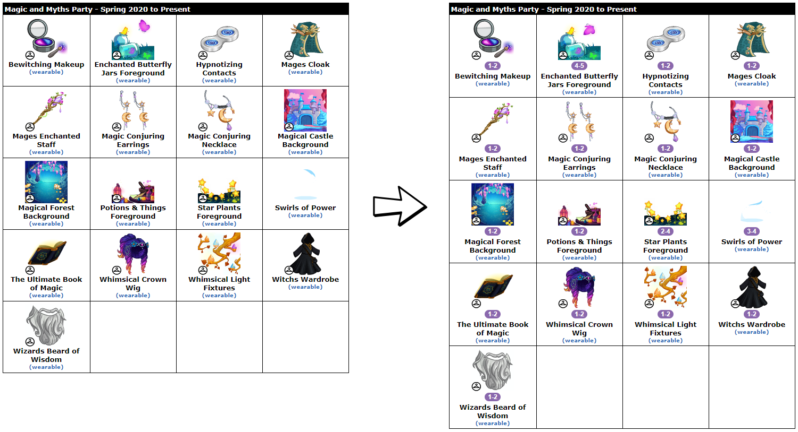

# NC-Trading-Valuator
Automatically label NC items with owls value. Visit ~/Owls and ~/OwlsTwo to refresh values.

Values items at:
- Neopets 
  - Beta Inventory
  - Classic Inventory
  - Closet
  - SDB
  - Gallery
- JellyNeo 
  - Item Database
  - Articles
- Classic DTI
  - Wardrobe / Customizer
  - User Item List
  - Item (also adds link to DTI 2020)
- 2020 DTI
  - Wardrobe / Customizer (a bit finicky; try refreshing)

#
#### Example: JN Shenanigifts Prizes

## Note:
This script is not associated with the wonderful people who run Owls, so if the page format changes I'll need to update it.
Previously this script was for /~waka

Owls is a community resource that tracks the approximate value of NC items, based on real-world trades:
GUIDES ARE ONLY GUIDES, NOT LAW.
/~Owls is not updated 24/7 and values or obtainability may have shifted since the last update.
An item listed at 00 - 00 means we do not currently have enough data to assign a value.
Please be aware that values, rarity, and popularity of any NC item are essential to consider and are usually factors in one's 
ability to find specific trades. Use your own discretion and make value check boards if you are unsure about items.
Owls lists the numerical values of items based on trade data reported by the community. We do not update subjectively and 
cannot modify values without trade reports.
Items without values lack values for differing reasons, including lack of data and recency of release. These items are NOT 
uniform in value or rarity: some are low, high, common, or rare. If you need help with an item that does not have a value 
listed, please make a value check board and/or contact a /~Owls team member.
